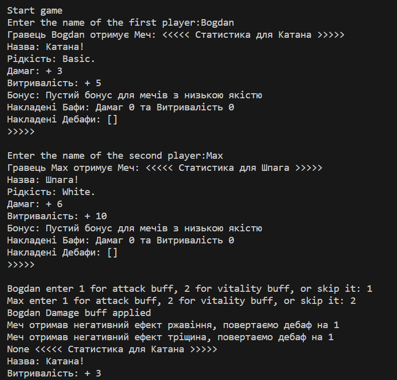

# Звіт до роботи №2
## Тема: _Базові навички роботи з класами в Python_
### Мета роботи: _Навчитись створювати та працювати з класами, розуміти основи ООП, і вміти використовувати класи для тестування програм, та створити програму яку будемо використовувати для тестування_

---
### Виконання роботи
* Результати виконання завданнь:
    1. Створили файл ноутбука для тестування окремих кусків коду та їх функціоналу [](./nb.ipynb);
    1. Використовуючи ООП написали клас який описує предмет Меча, та додали ще один клас, який реалізує бонуси для меча;
    1. Реалізацію Меча та бонусів ми винесли в окремий модуль який знаходиться в папці [game](./game/sword.py);
    1. Написали яка реалізує бій на мечах двома гравцями. Код гри поміщено у файлі [](./app.py);
    1. Запустили гру та продемонстрували, як 2 гравці можуть позмагатись на мечах;
    1. Програма вивела наступне  
    1. В наступних роботах будемо писати тести та виловлювати баги в нашій грі;
    1. Навчились ...
    1. ⭐ дайте відповідь на запитання:
        1. Чому коли передаємо значення None створюється обєкт з іменем Anonymous?
            - Коли ви передаєте значення None в конструктор класу MyName, він використовує значення за замовчуванням для імені, яке  встановлено як "Anonymous". Це робиться для того, щоб гарантувати, що у кожного екземпляра класу MyName буде ім'я, навіть якщо воно не явне.
        1. Як змінити текст привітання при виклику методу say_hello()? Допишіть цю частину коду.
            ```python 
            class MyName:
                # ...
                @staticmethod
                def say_hello(message="Hello to everyone!", name=None):
                    """Static method
                    """
                    if name is not None:
                        return f"You say: {message}, {name}!"
                    return f"You say: {message}"
            ```
        1. Допишіть функцію в класі яка порахує кількість букв і імені (підказка: використайте функцію len());
            ```python
            class MyName:
            # ...

            def count_letters(self):
                return len(self.name)
            ```
        1. Порахуйте кількість імен у списку names та порівняйте із виведеним результатом. Дайте відповідь чому маємо різну кількість імен?
            ```python
            names = ("Bohdan", "Marta", None)
            # Кількість елементів у списку
            number_of_names = len(names)
            # Кількість не None значень
            number_of_non_empty_names = 0
            for name in names:
                if name is not None:
                    number_of_non_empty_names += 1
            print(f"Кількість імен: {number_of_names}")
            print(f"Кількість не None значень: {number_of_non_empty_names}")

            ```
            - У списку names 3 елементи, але 2 з них не None. Це тому, що один з елементів списку має значення None.

---
### Висновок:
> у висновку потрібно відповісти на запитання:

- :question: Що зроблено в роботі;
- :question: Чи досягнуто мети роботи;
- :question: Які нові знання отримано;
- :question: Чи вдалось відповісти на всі питання задані в ході роботи;
- :question: Чи вдалося виконати всі завдання;
- :question: Чи виникли складності у виконанні завдання;
- :question: Чи подобається такий формат здачі роботи (Feedback);
- :question: Побажання для покращення (Suggestions);

---